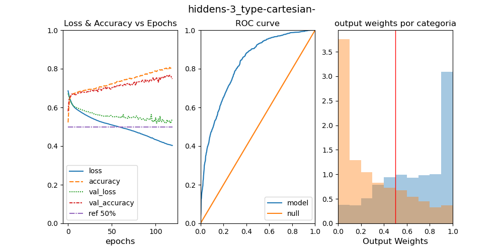

# AIFriendly-LHC
AI-Friendly learns to detect Higgs' Boson in a dataset with simulations from the Large Hadron Collider 

---

<h2>
<b>1) What are the features in a Large Hadron Collider database?</b>
</h2>
 
<i>The format this work refers to is the <a href="http://madgraph.phys.ucl.ac.be/Manual/lhco.html">LHCO</a> format. It has two three types of features: kinematic, particle numbers (e.g. leptonic number) and others (dummy features and event index). In the present work we will refer to the presence or absence of the particle numbers by refering to the 'full' database VS the 'kinematic' database.</i>
---

<h2>
<b>2) What is AI-Friendly's performance over the database?</b>
</h2>
 
<i>When trained over the full database (i.e. the database with both kinematic info and particle numbers info) AI-Friendly obtained a classification accuracy of more than 80% which led to a model with an area under the reciever operating curve (ROC) of more than 90% (see graph below).</i>

 
(LEFT: training metrics (loss and accuracy) for the training and validation set;MIDDLE: ROC-curve over the testing set; RIGHT: output weights per category over the testing set)

---

<h2>
<b>3) How important is the kinematic information?</b>
</h2>
 
<i></i>

 
()

---

<h2>
<b>4) How important is the coordinate system in which the kinematic information is expressed in?</b>
</h2>
 
<i></i>

 

 
()

---

<h2>
<b>5) Does adding more layers increase AI-Friendly's accuracy when the coordinate system is cartesian? Why?</b>
</h2>
 
<i></i>

 
()

